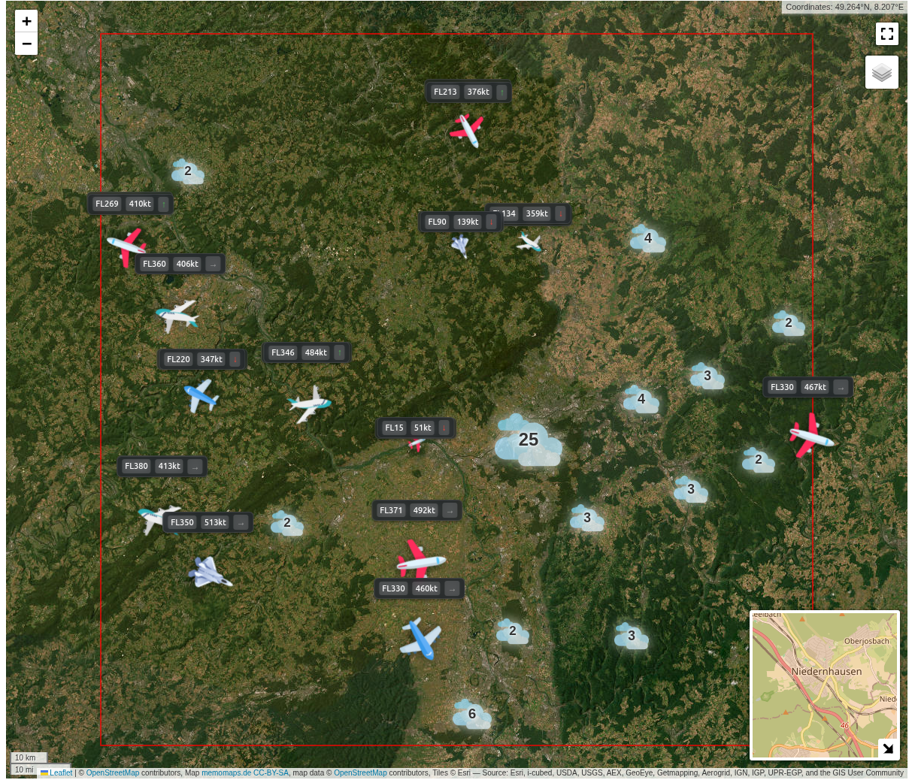

[](https://github.com/sarumaj/local-flight-map/actions/workflows/release.yml)
[](https://github.com/sarumaj/local-flight-map/actions/workflows/deploy.yml)
[](https://github.com/sarumaj/local-flight-map/releases/latest)
[](https://github.com/sarumaj/local-flight-map/blob/main/pyproject.toml)

---

# Local Flight Map

A real-time air traffic visualization tool that combines data from ADS-B Exchange and OpenSky Network to provide a comprehensive view of aircraft movements in your local area.

This app is currently hosted at [local-flight-map.sarumaj.com](https://local-flight-map.sarumaj.com).

[](https://local-flight-map.sarumaj.com)

## Features

- Real-time aircraft tracking and visualization
- Interactive map interface using Folium
- Data integration from multiple sources:
  - ADS-B Exchange API
  - OpenSky Network API
  - HexDB.io
- Fast and responsive web interface built with FastAPI
- Asynchronous data fetching for optimal performance

## API Documentation

### Data Sources

The application integrates data from multiple sources to provide comprehensive flight information:

#### OpenSky Network API
- **Authentication**: Username and password required for some endpoints
- **Endpoints**:
  - `/api/states/all`: Get all aircraft states
  - `/api/states/own`: Get aircraft states from own feeder
  - `/api/tracks/all`: Get all flight tracks

#### ADS-B Exchange API
- **Authentication**: API key required
- **Endpoints**:
  - `/v2/registration/{registration}`: Get aircraft by registration
  - `/v2/icao/{icao24}`: Get aircraft by ICAO24 address
  - `/v2/callsign/{callsign}`: Get aircraft by callsign
  - `/v2/sqk/{squawk}`: Get aircraft by squawk code
  - `/v2/mil`: Get military aircraft
  - `/v2/lat/{lat}/lon/{lon}/dist/{radius}`: Get aircraft in area

#### HexDB API
- **Base URL**: https://hexdb.io/
- **Endpoints**:
  - `/api/v1/aircraft/icao/{icao24}`: Get aircraft information
  - `/api/v1/airport/icao/{icao24}`: Get airport information
  - `/api/v1/route/icao/{callsign}`: Get route information

### API Client Usage

```python
from local_flight_map.api import (
    ApiConfig,
    AdsbExchangeClient, HexDbClient, OpenSkyClient,
    Location, BBox
)
from datetime import datetime

# Initialize the API configuration
config = ApiConfig(
    ads_b_exchange_api_key="your_api_key",
    opensky_client_id="your_client_id",
    opensky_client_secret="your_client_secret"
)

# OpenSky Network API Examples
async with OpenSkyClient(config) as opensky_client:
    # Get all aircraft states
    states = await opensky_client.get_states_from_opensky()
    
    # Get states for specific aircraft
    aircraft_states = await opensky_client.get_states_from_opensky(
        icao24="icao24_code"
    )
    
    # Get states in a specific area
    area_states = await opensky_client.get_states_from_opensky(
        bbox=BBox(min_lat=40.0, max_lat=41.0, min_lon=-74.0, max_lon=-73.0)
    )
    
    # Get states from own feeder
    own_states = await opensky_client.get_my_states_from_opensky(
        serials=[1, 2, 3]  # Optional: filter by sensor serial numbers
    )
    
    # Get flight track for specific aircraft
    track = await opensky_client.get_track_by_aircraft_from_opensky(
        icao24="icao24_code",
        time_secs=datetime.now()
    )

# ADS-B Exchange API Examples
async with AdsbExchangeClient(config) as adsbexchange_client:
    # Get aircraft by registration
    aircraft_by_reg = await adsbexchange_client.get_aircraft_from_adsbexchange_by_registration(
        registration="N12345"
    )
    
    # Get aircraft by ICAO24 address
    aircraft_by_icao = await adsbexchange_client.get_aircraft_from_adsbexchange_by_icao24(
        icao24="icao24_code"
    )
    
    # Get aircraft by callsign
    aircraft_by_callsign = await adsbexchange_client.get_aircraft_from_adsbexchange_by_callsign(
        callsign="ABC123"
    )
    
    # Get aircraft by squawk code
    aircraft_by_squawk = await adsbexchange_client.get_aircraft_from_adsbexchange_by_squawk(
        squawk="7500"
    )
    
    # Get military aircraft
    military_aircraft = await adsbexchange_client.get_military_aircrafts_from_adsbexchange()
    
    # Get aircraft within range
    aircraft_in_range = await adsbexchange_client.get_aircraft_from_adsbexchange_within_range(
        center=Location(latitude=40.7128, longitude=-74.0060),  # New York City
        radius=50  # radius in nautical miles (92.6 km)
    )

# HexDB API Examples
async with HexDbClient(config) as hexdb_client:
    # Get aircraft information
    aircraft_info = await hexdb_client.get_aircraft_information_from_hexdb(
        icao24="icao24_code"
    )
    
    # Get airport information
    airport_info = await hexdb_client.get_airport_information_from_hexdb(
        icao24="KJFK"  # ICAO airport code
    )
    
    # Get route information
    route_info = await hexdb_client.get_route_information_from_hexdb(
        callsign="ABC123"
    )
```

### Response Objects

#### OpenSky Network API
- `StateVector`: Contains aircraft position, speed, altitude, and other flight data
  - Basic info: ICAO24, callsign, origin country
  - Position: latitude, longitude, altitude (barometric and geometric)
  - Performance: velocity, true track, vertical rate
  - Status: on ground, squawk, special position indicator
  - Source: position source (ADS-B, ASTERIX, MLAT, FLARM)
  - Category: aircraft category (Light, Small, Large, Heavy, etc.)
- `States`: Collection of StateVector objects with timestamp
- `FlightTrack`: Contains flight path data with waypoints
  - Basic info: ICAO24, callsign, start/end time
  - Path: list of waypoints with position and altitude data
- `Waypoint`: Individual position point in a flight track
  - Time: Unix timestamp
  - Position: latitude, longitude
  - Altitude: barometric altitude
  - Track: true track angle
  - Status: on ground flag

#### ADS-B Exchange API
- `AircraftProperties`: Detailed aircraft information including:
  - Basic info: ICAO24, registration, type, callsign
  - Position: latitude, longitude, altitude (barometric and geometric)
  - Performance: ground speed, airspeed (indicated/true), Mach number
  - Weather: wind direction/speed, outside air temperature
  - Navigation: track angle, heading, rate of climb/descent
  - System status: squawk, emergency status, category
  - Technical: signal strength, GPS status, message count
  - Navigation modes: QNH, MCP/FMS altitude, heading
  - Integrity: navigation accuracy, surveillance level
- `AdsbExchangeResponse`: Container for aircraft data with:
  - List of aircraft
  - API message
  - Timestamps
  - Processing information

#### HexDB API
- `AircraftInformation`: Aircraft registration and type details
  - Basic info: ICAO type code, manufacturer, Mode S code
  - Registration: operator flag code, registered owners, registration number
  - Type: aircraft type description
- `AirportInformation`: Airport location and identification
  - Codes: IATA, ICAO, country code
  - Location: latitude, longitude
  - Details: airport name, region name
- `RouteInformation`: Flight route details
  - Flight: flight number
  - Route: route description
  - Update time: timestamp of last update

All response objects support conversion to GeoJSON format for easy integration with mapping libraries.

## Requirements

- Python 3.12 or higher
- Internet connection for API access
- Web browser for viewing the map interface

## Installation

1. Clone the repository:
```bash
git clone https://github.com/sarumaj/local-flight-map.git
cd local-flight-map
```

2. Create and activate a virtual environment:
```bash
python -m venv .venv
source .venv/bin/activate  # On Windows: .venv\Scripts\activate
```

3. Install the package:
```bash
pip install -e .
```

## Configuration

Create a `.env` file in the project root with your API credentials:
```
ADS_B_EXCHANGE_API_KEY=your_api_key_here
OPENSKY_USERNAME=your_username_here
OPENSKY_PASSWORD=your_password_here
```

## Usage

1. Start the application:
```bash
local-flight-map
```

2. Open your web browser and navigate to `http://localhost:5006`

3. The interactive map will display:
   - Current aircraft positions and path tracking
   - Aircraft information on hover
   - Real-time updates

## Development

To run tests:
```bash
pip install -e ".[test]"
pytest
```

## License

This project is licensed under the MIT License - see the [LICENSE](LICENSE) file for details.

## Contributing

Contributions are welcome! Please feel free to submit a Pull Request.